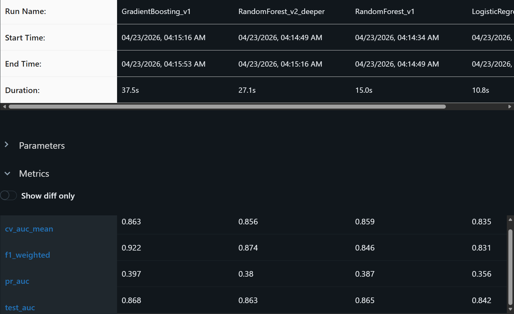
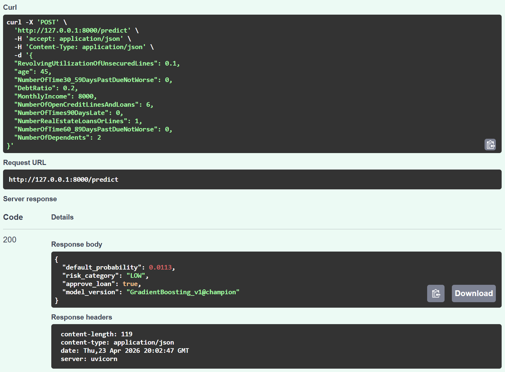

# 🏦 Loan Default Prediction — End-to-End MLOps Pipeline

> Predicts probability of loan default using a GradientBoosting classifier,
> with full experiment tracking via MLflow and a live REST API via FastAPI.

---

## 📌 Project Highlights

- Trained and compared **4 models** (Logistic Regression, Random Forest ×2, GradientBoosting)
- Tracked all experiments with **MLflow** — parameters, metrics, and artifacts
- Best model achieved **AUC: 0.868 | PR-AUC: 0.397** on imbalanced data (7% default rate)
- Promoted best model using **MLflow alias-based registry** (`@champion`)
- Served predictions via a **FastAPI REST endpoint** with Pydantic input validation
- CV AUC within 0.005 of test AUC — confirms model generalizes, not overfitting

---

## 🗂️ Project Structure

```
loan-default-mlops/
│
├── data/
│   └── loan_data.csv
├── notebooks/
│   └── 01_eda.ipynb
├── src/
│   ├── train.py        ← MLflow experiment tracking
│   ├── predict.py      ← Load model from registry
│   └── api.py          ← FastAPI inference server
├── mlruns/             ← Auto-generated by MLflow
├── requirements.txt
└── README.md
```

---

## 🧪 Experiment Results

| Model | Test AUC | PR-AUC | CV AUC | F1 |
|---|---|---|---|---|
| **GradientBoosting_v1** ✅ | **0.868** | **0.397** | **0.863** | **0.922** |
| RandomForest_v1 | 0.865 | 0.387 | 0.859 | 0.846 |
| RandomForest_v2_deeper | 0.863 | 0.380 | 0.856 | 0.874 |
| LogisticRegression_baseline | 0.842 | 0.356 | 0.835 | 0.831 |

> **Note:** RF_v2 (deeper trees) underperformed RF_v1 slightly — indicating mild
> overfitting with increased depth, a common real-world trade-off.

> **Note:** PR-AUC is prioritised over AUC here due to class imbalance
> (7% default rate). A random classifier scores ~0.07 PR-AUC;
> our model scores 0.397 — ~5x better on the minority class.

---

## ⚙️ MLflow Experiment Tracking

All runs are logged with:
- **Parameters** → model hyperparameters
- **Metrics** → AUC, PR-AUC, CV AUC, F1
- **Artifacts** → full sklearn Pipeline (imputer + scaler + model)

Model promoted to production using MLflow's alias system:
```python
# Load champion model — no hardcoded file paths
model = mlflow.sklearn.load_model("models:/GradientBoosting_v1@champion")
```

> 

---

## 🚀 API Usage

### Run the server
```bash
cd src
python api.py
# Server starts at http://localhost:8000
# Interactive docs at http://localhost:8000/docs
```

### Sample Request
```bash
POST /predict
Content-Type: application/json

{
  "RevolvingUtilizationOfUnsecuredLines": 0.95,
  "age": 28,
  "NumberOfTime30_59DaysPastDueNotWorse": 4,
  "DebtRatio": 0.85,
  "MonthlyIncome": 2500,
  "NumberOfOpenCreditLinesAndLoans": 12,
  "NumberOfTimes90DaysLate": 3,
  "NumberRealEstateLoansOrLines": 0,
  "NumberOfTime60_89DaysPastDueNotWorse": 2,
  "NumberOfDependents": 3
}
```

### Sample Response
```json
{
  "default_probability": 0.824,
  "risk_category": "HIGH",
  "approve_loan": false,
  "model_version": "GradientBoosting_v1@champion"
}
```

> 

---

## 🛠️ Setup & Installation

```bash
# Clone the repo
git clone https://github.com/rajput-t/loan-default-mlops
cd loan-default-mlops

# Install dependencies
pip install -r requirements.txt

# Train models & log to MLflow
cd src
python train.py

# View experiment results
cd ..
python -m mlflow ui --backend-store-uri mlruns

# Run the API
cd src
python api.py
```

---

## 📦 Tech Stack

| Tool | Purpose |
|---|---|
| Scikit-learn | Model training & pipelines |
| MLflow | Experiment tracking & model registry |
| FastAPI | REST API serving |
| Pydantic | Input validation & schema enforcement |
| Pandas / NumPy | Data processing |
| Uvicorn | ASGI server |

---

## 📊 Dataset

**Give Me Some Credit** — Kaggle Competition Dataset
- 150,000 applicant records
- 10 financial features
- Binary target: `SeriousDlqin2yrs` (loan default within 2 years)
- Source: kaggle.com/c/GiveMeSomeCredit

---

## 💡 Key Design Decisions

**Why PR-AUC over AUC?**
With only 7% positive class, AUC can look deceptively good even with a poor model. PR-AUC focuses specifically on the minority class performance — which is what actually matters in a loan default context.

**Why alias-based model promotion?**
MLflow deprecated stage-based promotion (Staging/Production) in 2026. This project uses the current best practice — alias-based promotion (`@champion`) — following MLflow 2.x standards.

**Why a sklearn Pipeline?**
Wrapping imputer + scaler + model in a single Pipeline ensures the preprocessing is always applied consistently at inference — eliminating a common source of training-serving skew.